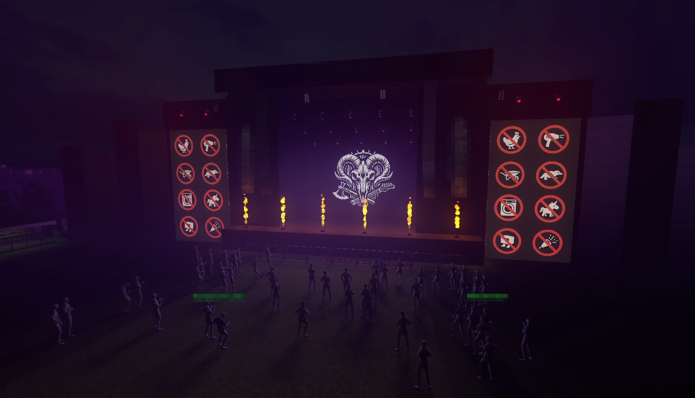

# StreamerSharp-Backend

Modular backend platform developed in C# with ASP.NET Core, designed to integrate external services (Twitch, Spotify) using centralized authentication through asymmetric JWT.

The implementation remains private.

This repository focuses on architecture, design decisions, deployment processes and system interactions rather than source code distribution.

## Features

- Centralized authentication using asymmetric JWT
- Dedicated services for Twitch and Spotify
- Service-oriented modular architecture
- Docker containerization
- CI/CD pipeline using Gitea
- Automated deployment on Jelastic

## Technologies

- C#
- ASP.NET Core
- JWT Authentication (asymmetric encryption)
- REST APIs
- Docker
- Gitea CI/CD
- Jelastic

## Architecture

The application is built around multiple independent services sharing a centralized authentication system and communicating with external APIs.

See:

- [Architecture](docs/architecture.md)

## Deployment

The project uses Docker for service containerization, with a CI/CD pipeline handling image build and automated deployment. Automated tests are also in place to ensure service reliability and expected behavior.

See:

- [Deployment process](docs/deployment.md)

## Technical Goals

The architecture aims to:

- Centralize authentication
- Reduce coupling between services
- Simplify the integration of new external services
- Provide consistent API interfaces for client applications
- Promote component and service reusability
- Simplify deployment and maintenance
- Improve system scalability and extensibility

# Use Case: Interactive 3D Festival Environment

The backend services are used by a 3D application developed with Godot, simulating an interactive festival environment.

Features include:

- Real-time Twitch interactions
- Spotify synchronization
- Event redistribution to the 3D client
- OBS integration
- Viewer avatars
- Dynamic animations and visual effects

## Audio & Environment

A separate application analyzes local audio output using FFT in order to generate animations synchronized with the music.

Examples:

- Dynamic spotlight movements
- Intensity variations
- Reactive visual effects

This approach allows visual elements to react in real time to the currently playing audio.

The analyzer extracts simplified frequency bands and sends them over UDP to drive visual effects within the 3D environment.

Related project:

- [StreamerSharp Audio FFT Analyzer](https://github.com/Malik-Fleury/StreamerSharp-MusicFFTServer)