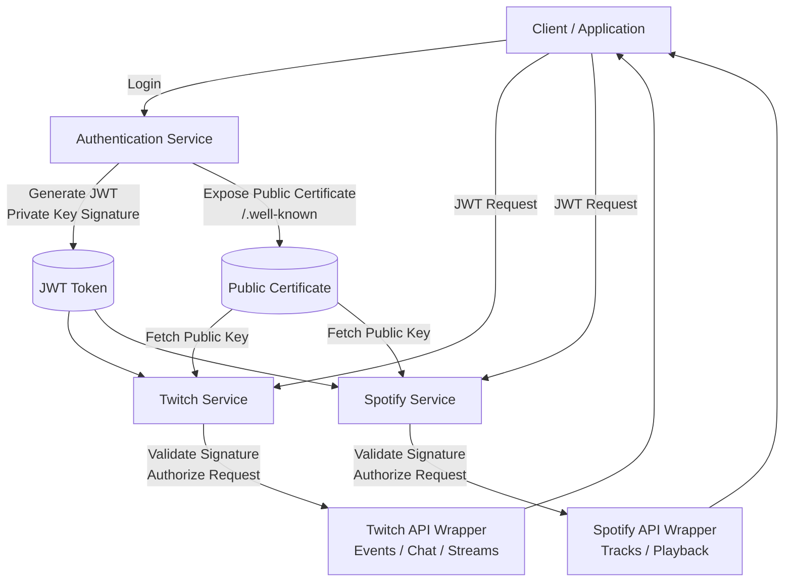
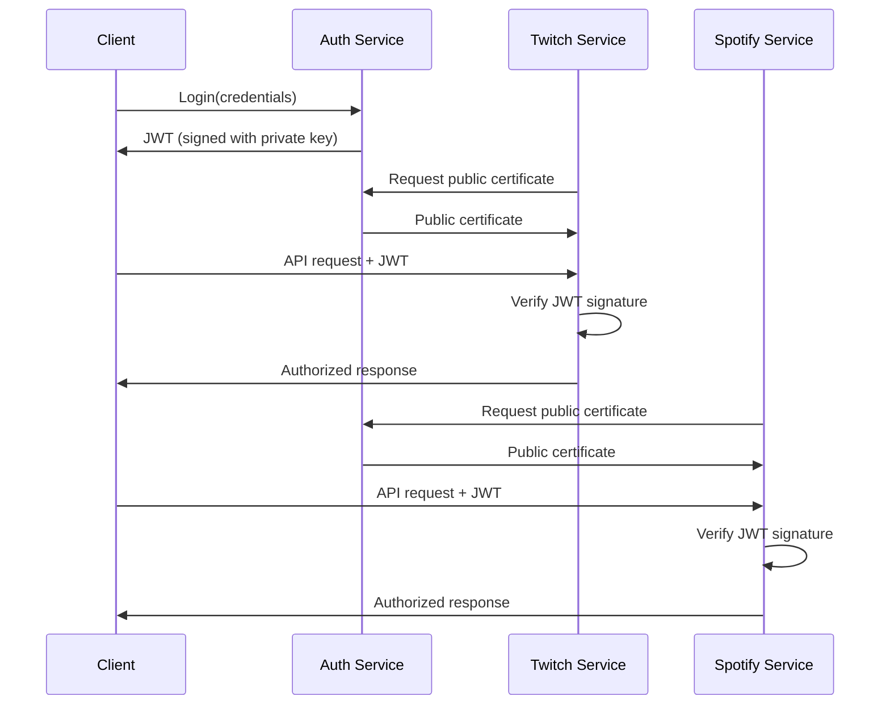

# Architecture

The solution is composed of four main projects:

## Authentication Service

Centralized authentication service.

### Responsibilities

- generation of signed JWT tokens;
- identity validation;
- exposure of a public certificate allowing other services to verify tokens.

---

## Twitch Service

Intermediate service acting as a bot connected to Twitch.

It simplifies interactions with the Twitch ecosystem and exposes a consistent interface to client applications.

### Responsibilities

- JWT validation;
- communication with the Twitch API;
- data transformation;
- exposure of a consistent API for client applications.

---

## Spotify Service

Intermediate service simplifying interactions with the Spotify API.

### Responsibilities

- JWT validation;
- communication with the Spotify API;
- data normalization;
- exposure of a consistent API for client applications.

---

## Shared

Shared library containing contracts used between services and client applications.

### Contents

- DTOs;
- requests;
- responses;
- communication models.

### Purpose

Provide consistent interfaces across services and reduce duplication on the client side.

## Flow

## Sequence

