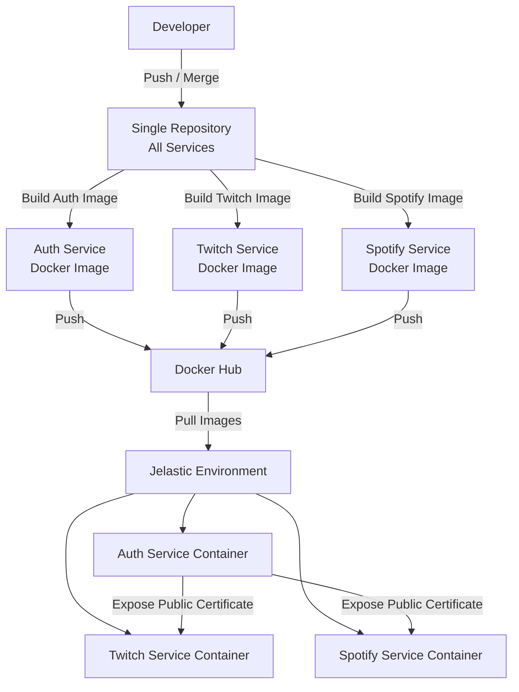

# Deployment process

```mermaid
flowchart TD

    Dev[Developer] -->|Push / Merge| Repo[Single Repository\nAll Services]

    Repo -->|Build Auth Image| AuthImage[Auth Service\nDocker Image]
    Repo -->|Build Twitch Image| TwitchImage[Twitch Service\nDocker Image]
    Repo -->|Build Spotify Image| SpotifyImage[Spotify Service\nDocker Image]

    AuthImage -->|Push| DockerHub[Docker Hub]
    TwitchImage -->|Push| DockerHub
    SpotifyImage -->|Push| DockerHub

    DockerHub -->|Pull Images| Jelastic[Jelastic Environment]

    Jelastic --> AuthContainer[Auth Service Container]
    Jelastic --> TwitchContainer[Twitch Service Container]
    Jelastic --> SpotifyContainer[Spotify Service Container]

    AuthContainer -->|Expose Public Certificate| TwitchContainer
    AuthContainer -->|Expose Public Certificate| SpotifyContainer
```